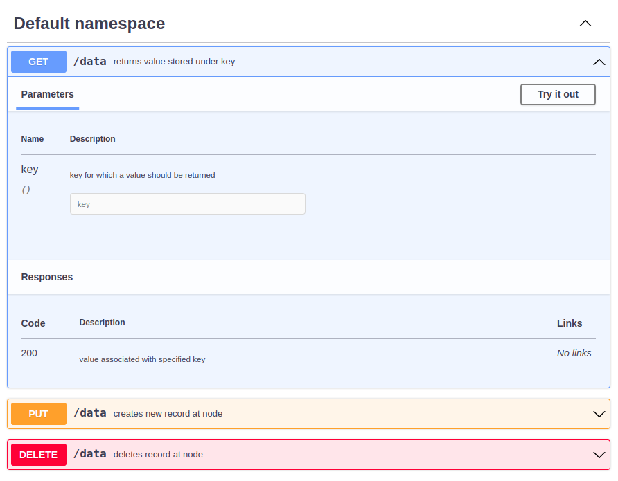
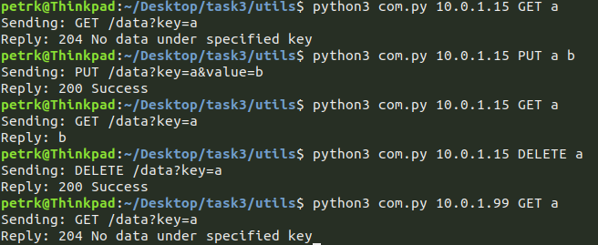

# Task 3
This repository contains source code for DS task 3. The goal of task 3 was to implement distributed cache structured as a binary tree and use zookeeper nodes to record the structure of the binary tree.

## Implementation
The program is partly implemented in C++ and Python. Python is used because of the **KazooClient** library, as it was introduced in the KIV/DS course. Docker is used to run the nodes and Vagrant is used to set up the Docker nodes. The dockerfile doesn't use multi-stage build due to time constraints of the project implementation, but it would be preferable to reduce the size of the Docker images.

The nodes communicate with each other using UDP and the communication with Zookeeper is realized through embedded Python in C++. Only the root communicates with Zookeeper.

When the root is started it creates a root zoonode at Zookeeper and then starts listening for incoming requests. Each node then sends a request to root to obtain its parent address. The root contacts Zookeeper, creates a new zoonode there corresponding to the node and then replies to the node with its new parent address.

### OpenAPI



## Build and run
To run the application use the command
```
vagrant up
```
inside the folder where Vagrantfile is located.

For setting up the depth of the tree change
```
TREE_DEPTH = 3
```
inside Vagrantfile to desired number.


To read logs from the nodes use portainer or command 
```
vagrant docker-logs
```

## Testing

There is a simple python script included in the ***utils*** folder. Here is an example of the script usage




The structure of the cache binary tree can be checked using **ZooNavigator** at http://localhost:9000
