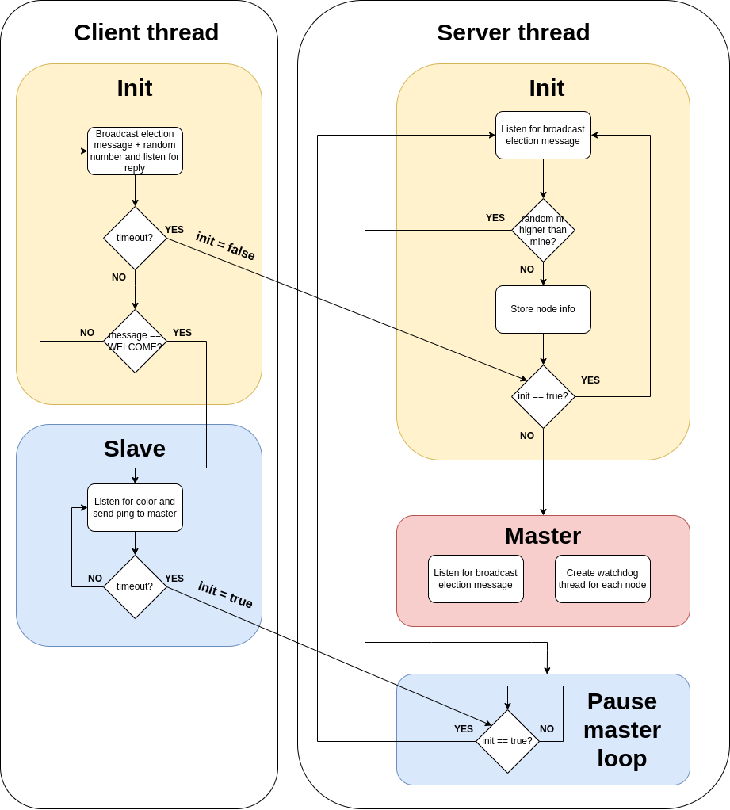

# Task 1 and 2
This repository contains source code for both DS task 1 and 2. Task 1 was to implement master election algorithm for n nodes (n≥3) and then let master color the nodes green and red (in 1:2 ratio). Task 2 was to implement additional failure detection for task 1 that will correct color ratio if it is broken or start new master election if master goes offline.
# Master election with failure detector
## Solution description
### Master election
Each node is assigned a random number which it then broadcasts to other nodes in the network. When a node receives a broadcast with higher node number than its own or a reply to its broadcast, it stops listening for broadcast messages and waits for WELCOME message from master. If a node doesn't receive a reply to its broadcast before a timeout then it means it has the highest number in the network -> it becomes master. If a node with higher number joins the network after master is elected, it becomes a slave node, therefore, a node with the highest number doesn't have to be the master.

Broadcasting and listening for broadcast is done each in a different thread. The following picture describes the control flow of the two threads.




### Failure detector
Master creates a watchdog thread for each slave node, which checks if the node is alive and sends it its color. At the start of the watchdog thread, desired node color is computed and then send to the slave node periodically. When a node pings master, master writes its number to a vector, which the watchdog threads checks in defined intervals. If a node number isn't in the vector, its watchdog thread knows the node is dead and exits. When a watchdog thread ends, it recomputes color ratio and updates colors for other nodes accordingly.
### Color computation
The colors computation is described in the following pseudo code snippet. 1/3 of the nodes should be green and 2/3 should be red, number of green nodes is rounded up.
```
if(total%3 == 0)
{
    greens = total/3;
}
else
{
    greens = (total+3)/3
}
```


## Build and run
To run the application use the command
```
vagrant up
```
inside the folder where Vagrantfile is located.

For setting up the number of nodes change the 
```
NODES_COUNT = 5
```
inside Vagrantfile to desired number.


To read logs from the nodes use portainer or command 
```
vagrant docker-logs
```


## Testing

Master election can be tested just by running the application. New master election can be tested by stopping the master node container, color change can be tested by breaking the color ratio by stopping a color node container.

Here are log snippets of some common scenarios:

#### Master log


#### Slave log


#### Master dead


#### Master dead + color change


